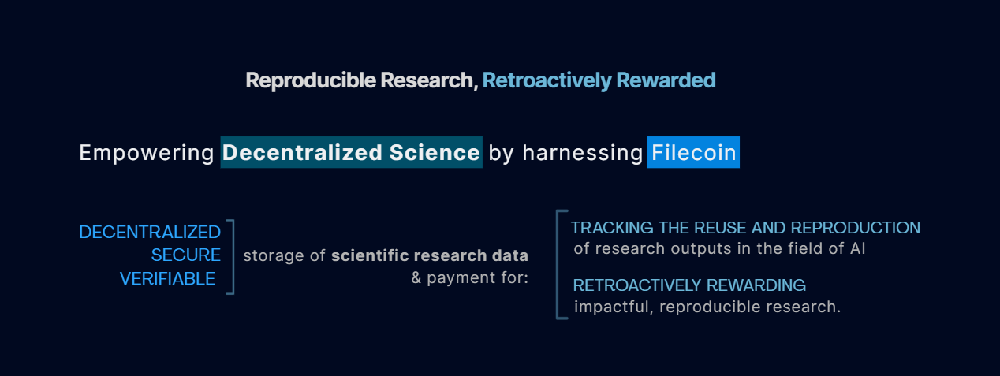
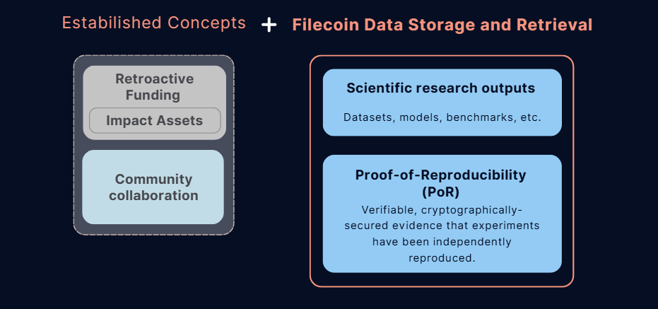
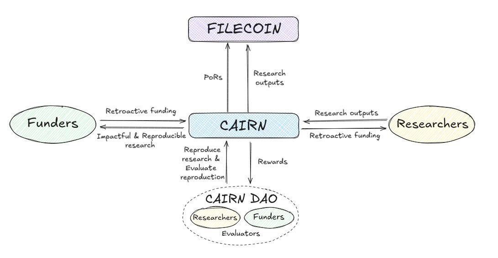

# Cairn

## 🌍 Overview

**Cairn** is a decentralized protocol and platform designed to track the reuse and reproducibility of scientific outputs in the field of artificial intelligence, retroactively rewarding impactful research.\
 
By leveraging decentralized storage, smart contracts, and tokenized impact assets, Cairn creates a transparent, incentive-aligned ecosystem that connects scientists, funders, and the research community. It introduces the Proof of Reproducibility (PoR) to verify experiment replication, uses Filecoin for secure and verifiable data storage, and employs smart contracts on the Filecoin Virtual Machine to manage project registration, impact evaluation, and retroactive funding via USDFC stablecoin payments.

 

 

### Core Features:

- ✅ **Proofs of Reproducibility (PoRs)** - Verifiable evidence that research outputs (models, datasets, papers) can be independently replicated.

- 📊 **Impact Tracking & Metrics** - Aggregates reuse signals across HuggingFace, ArXiv, etc. and surfaces which outputs are not only reproducible but also used by the community.

- 💰 **Retroactive Funding Flows** - Rewards are distributed based on verified reproducibility and impact of the research outputs. 

## ⚠️ Challenges in Scientific Research

Scientific research, especially in the field od **artificial intelligence**, faces systemic challenges that hinder progress and equitable participation:

- **🚫 Poor incentives for long-term, impactful work:** \
Academic recognition and funding systems tend to reward novelty and publication volume over real-world impact, long-term usability, and reproducibility.

- **🔎 Reproducibility  and transparency issues:** \
A significant portion of published AI research cannot be reliably reproduced due to opaque methodologies, missing data, or proprietary tooling. This not only wastes resources but also undermines trust and slows scientific advancement.

- **🔒  Centralized control and limited access:** \
Research output and funding are heavily concentrated within a small number of elite institutions and corporations. This creates high barriers to entry, excludes underrepresented voices, and narrows the diversity of ideas and approaches.

- **💸 Funding inefficiency:** \
Funders struggle to identify and support projects with the highest potential for real-world impact, largely due to a lack of standardized, transparent indicators of research quality and reuse potential.

 

> Collectively, these challenges create a research ecosystem where meaningful, reusable, and socially beneficial work is hard to surface, fund, and scale, ultimately limiting the potential of AI research to serve broader public good.
 

---
## 💡  Our Solution

We propose a transparent, community-driven system that incentivizes the production and validation of reproducible, high-impact research through retroactive funding:

1. **Retroactive Funding as Incentive** \
Researchers are rewarded after their work has demonstrated real-world impact and reproducibility. This shifts the incentive structure away from publication quantity toward long-term utility, transparency, and community use.

2. **Reproducibility as a Funding Criterion**\
 To qualify for funding, research outputs must be:
   - Accompanied by clear, complete, and open instructions for reproduction
   - Successfully reproduced by independent contributors
   - Used or cited by others in the ecosystem (impactful)

3. **Community Verification (DAO)** \
  A decentralized group of contributors evaluates reproducibility claims, submits proofs, and votes on their validity. This crowdsourced model improves trust, scalability, and reduces gatekeeping.

4. **Decentralized Storage** \
 All research artifacts and reproducibility proofs are stored on Filecoin, ensuring they are:
    - Immutable and tamper-proof
    - Publicly accessible and verifiable
    - Permanently linked to the funding mechanism via smart contracts

  

 

The system is designed to incentivize and validate impactful, reproducible scientific research by connecting researchers, funders, and decentralized infrastructure via a Web3-native workflow. It is built around the
Cairn platform, with various stakeholders and components described below:
 

---

## ⚙️ Filecoin integration
Cairn integrates Filecoin technology as a foundational layer to ensure decentralized, secure, and verifiable storage of scientific research data and metadata:

- **Smart Contracts on the Filecoin Network:**  
  Cairn’s smart contract is currently deployed on the Filecoin calibration testnet.

- **Data Storage and Retrieval:**  
  All scientific research outputs—including datasets, machine learning models, benchmarks, and Proofs of Reproducibility (PoRs)—are stored on **Filecoin**. This ensures **data provenance, immutability, and long-term availability**.

- **Crypto-based Payments with USDFC Stablecoin:**  
  Cairn uses the **USDFC stablecoin**, native to Filecoin’s ecosystem, to enable **stable, trustless, and efficient capital flows** between funders and researchers, supporting usage-based billing and retroactive funding models.

  
## All Architecture & Integrations

| Component         | Technology / Protocol         | Purpose                                              |
|-------------------|------------------------------|------------------------------------------------------|
| Storage           | **Filecoin**      | Decentralized, verifiable storage of all research data and metadata |
| Payments          | **USDFC Stablecoin**         | Stable, on-chain funding and rewards                 |
| Smart Contracts   | **Filecoin Virtual Machine (FVM)** | Transparent, immutable project and funding logic     |

## 👉 How Cairn Works

 ### 👩‍🔬 A Researcher’s Journey

1. **Connect your account:**  
  Link Cairn with HuggingFace, ArXiv, GitHub, and other platforms to automatically import your research.

2. **Create a Project:**  
  Select your existing research outputs or upload new ones - code, datasets, papers etc. and create a project with metadata and outputs.

3. **Proof of Reproducibility (PoR):**  
  Evaluators review and replicate your work, and submit cryptographically-secured Proofs of Reproducibility (PoRs) logs and other proofs stored on Filecoin and linked on-chain. This provides verifiable evidence of reproducibility.

4. **Impact Evaluation:**  
  Designated evaluators, researchers and funders vote on each project’s impact. Future implementations will introduce DAO-based community voting.

5. **Retroactive Funding:**  
  Once a project meets the required criteria (verified PoRs, impact evaluation), it can be submitted for a funding round.

     **Dispute Resolution:**  
Community members can challenge submitted PoRs through a dispute mechanism, ensuring the integrity and trustworthiness of reproducibility claims.

### 💸 A Funder’s Perspective

1. **Fund Research Projects:**  
Start a funding round to support projects that align with what you value.

2. **Assess Impact:**  
  Track reproducibility metrics and identify projects delivering real value.

3. **Track Your Contribution:**  
onitor the real-world outcomes of your funding through transparent, on-chain reporting. 

### 👀 A Guest’s Perspective

1. **Explore Projects:**  
Browse projects, models, datasets and other outputs that have verified proof of reproducibility.

2. **Follow Impact:**  
  See which projects are gaining traction and reuse.

3. **Download Outputs:**  
Download open-source data and PoR proofs from Filecoin.

## 🛠 Tech Stack ##

-  w3up-client – IPFS-based storage services (decentralized file management)
- ethers.js – Blockchain network interactions & decentralized features
- React – Component-based UI architecture
- TypeScript – Static typing for JavaScript (enhanced reliability)
- Vite – Blazing-fast dev server + optimized production builds
- Tailwind CSS – Utility-first CSS for rapid UI development
- Foundry – Ethereum toolkit (forge, anvil, cast)
- Node.js – Backend runtime (optional for scripting/frontend)
  
👉 **Note:** For detailed setup instructions for smart contracts, frontend, and other modules, see the respective subdirectory README files.

---

## 🌐 Live Demo ##

[Try the Cairn App](https://cairn-app-9vb6z.ondigitalocean.app/)\
▶️ Watch our demo video: [YouTube](https://www.youtube.com/watch?v=aHEJTJmeWjM&ab_channel=LukaLevac) \
X:  Cairn [@cairn_platform](https://x.com/cairn_platform)

## 📜 License ##

This project is licensed under the MIT License.