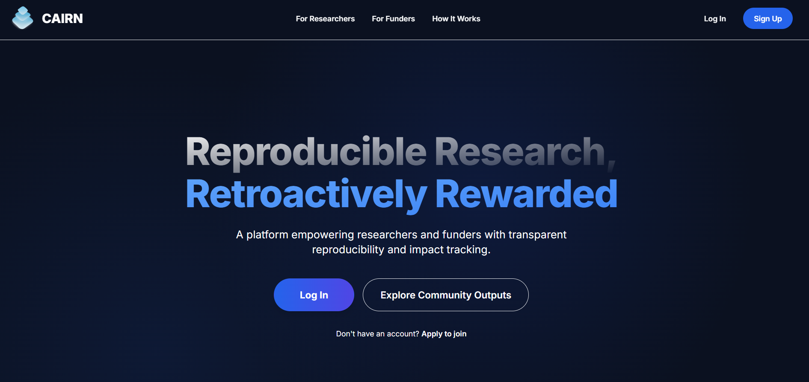
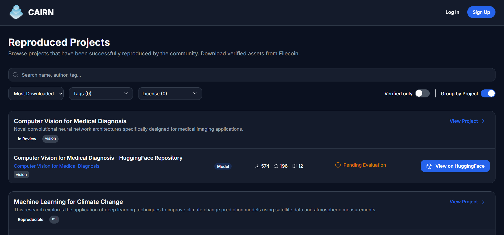
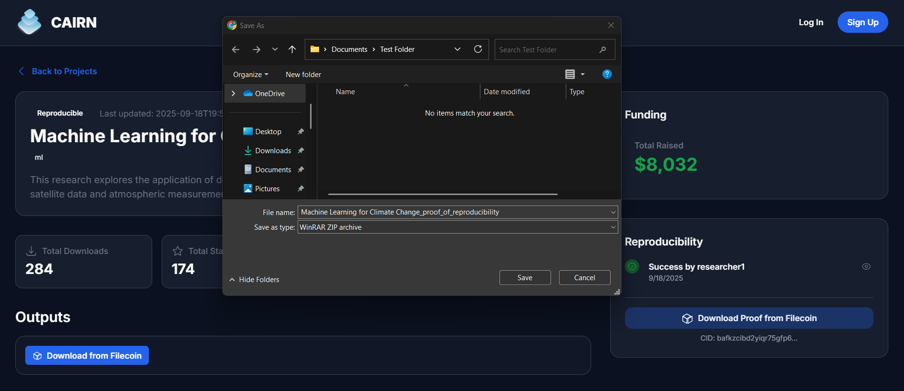

# Cairn - Front End App

## 🌍 Overview

This is the frontend application for 👉 [Cairn app](https://cairn-app-9vb6z.ondigitalocean.app/), a decentralized platform that tracks the reproducibility and impact of AI research.
The frontend provides dashboards for researchers, funders and guest to interact with Cairn’s backend services, smart contracts, and data ingestion APIs.

<br>

<br>

<br>

<br>

<br>

<br>

## 🧪 Features Implemented

- Project registration + metadata submission UI

- Proof of Reproducibility (PoR) submission UI

- Filecoin storage UI

- Implementation of Minimal Funding Process

- HuggingFace web2 data ingestion (upcoming)

- Impact metrics integration (upcoming)

## Key Technologies

- **React**: Provides a component-based architecture for building interactive UIs.
- **TypeScript**: Adds static typing to JavaScript, improving code quality and maintainability.
- **Vite**: Offers lightning-fast development server and optimized production builds.
- **Tailwind CSS**: Enables rapid UI development with utility classes.

## Live demo

Visit: [Cairn app](https://cairn-app-9vb6z.ondigitalocean.app/) <br>

---

## Getting Started

1. **Install dependencies**:

    ```bash
    npm install
    ```

2. **Create a `.env` file** in the root directory and add your environment variables:

    ```env
    VITE_AGENT_KEY=xxxxx
    VITE_PROOF=xxxxx
    ```

2. **Run the development server**:

    ```bash
    npm run dev
    ```

3. **Build for production**:

    ```bash
    npm run build
    ```

## Learn More

- [React Documentation](https://react.dev/)
- [TypeScript Handbook](https://www.typescriptlang.org/docs/)
- [Vite Guide](https://vitejs.dev/guide/)
- [Tailwind CSS Docs](https://tailwindcss.com/docs)
  
---
